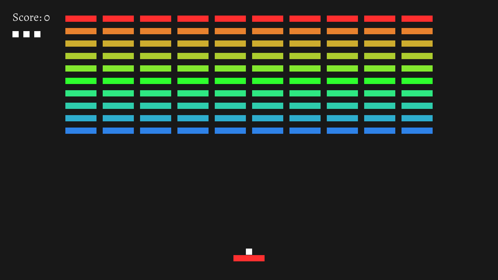

# JaiBreak

[](https://tsoding.org/jaibreak)

## Quick Start

```console
$ jai -version
Version: beta 0.1.033, built on 21 July 2022.
```

### Native Build

```console
$ jai ./first.jai
$ ./jaibreak-release
```

### WebAssembly Build

*WebAssembly builds only on Linux right now.*

```console
$ jai ./first.jai
$ python3 -m http.server 6969
$ iexplore.exe http://localhost:6969/
```

You can also check an already deployed WebAssembly version here: [https://tsoding.org/jaibreak](https://tsoding.org/jaibreak).

## Controls

|keys|description|
|---|---|
|<kbd>A</kbd>/<kbd>D</kbd>|move bar left/right|
|<kbd>ESC</kbd>|toggle pause|
|<kbd>SPACE</kbd>|release the "ball"|

### Debug Build

|keys|description|
|---|---|
|<kbd>F5</kbd>|Hotreload [params.conf](params.conf)|
|<kbd>F3</kbd>|Make an SVG screenshot|

## References

- https://github.com/tsoding/zigout
- https://www.youtube.com/watch?v=AMUv8KvVt08
