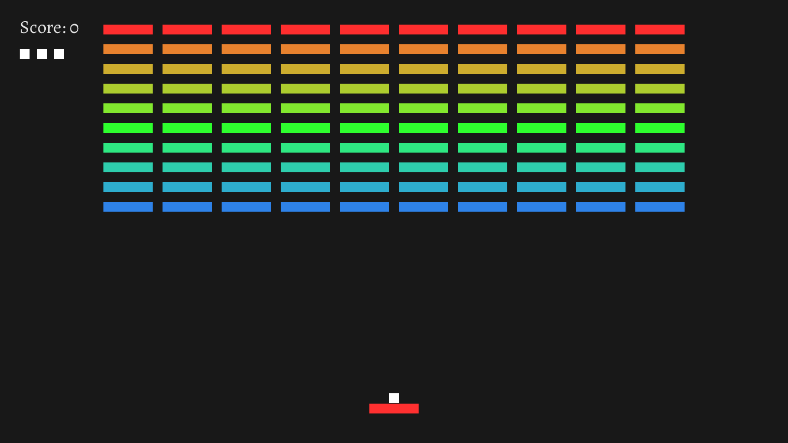

# JaiBreak



## Quick Start

```console
$ jai -version
Version: beta 0.1.031, built on 11 July 2022.
$ jai first.jai
$ ./jaibreak
```

## Controls

- <kbd>A</kbd>/<kbd>D</kbd> — move bar left/right
- <kbd>SPACE</kbd> — release the "ball"

### Debug Build

- <kbd>F5</kbd> — Hotreload [params.conf](params.conf)

## References

- https://github.com/tsoding/zigout
- https://www.youtube.com/watch?v=AMUv8KvVt08
